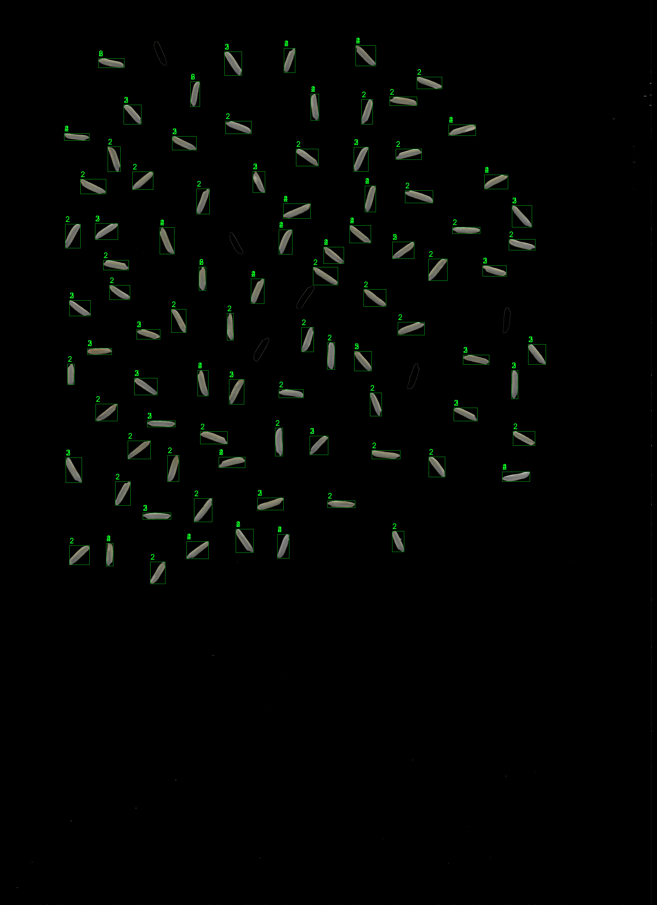

# Rice-Grain-dectection-and-classification-

main idea of the project is to detect and classify the rice grain so the result will be something like that 

#Using machine learning model such as random forest and deep learning learning  model such as deep neural network

